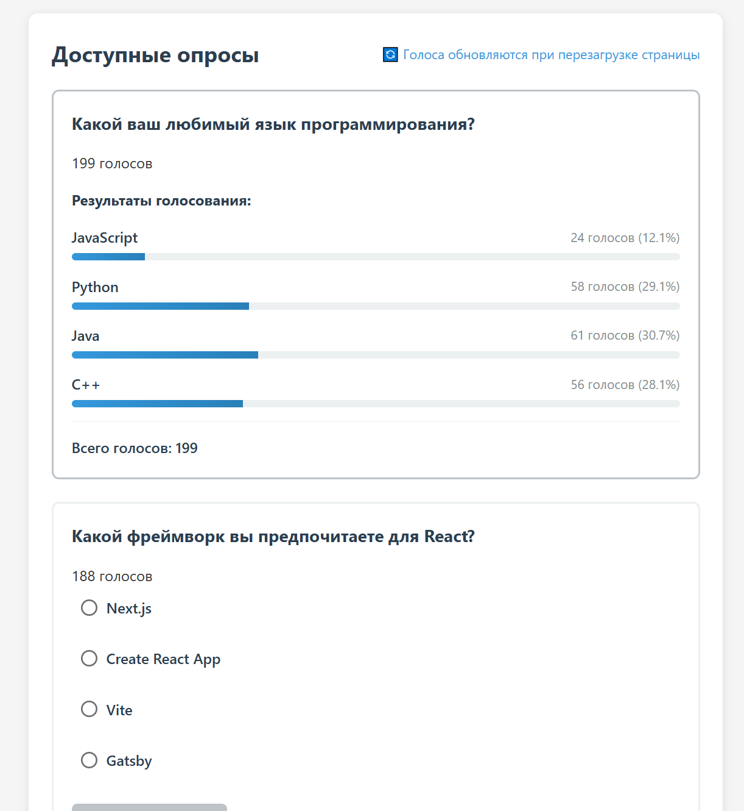

ССЫЛКА НА САЙТ: https://kogami-sh1nya.github.io/KR4x/
Система голосования - это полнофункциональное веб-приложение, разработанное на React с использованием современного сборщика Vite. Приложение позволяет создавать опросы, участвовать в голосовании и просматривать результаты в реальном времени с визуализацией данных.
Основной функционал:
- Создание новых опросов с произвольными вопросами и вариантами ответов
- Динамическое добавление/удаление вариантов ответов
- Интуитивный интерфейс для управления содержимым опросов

